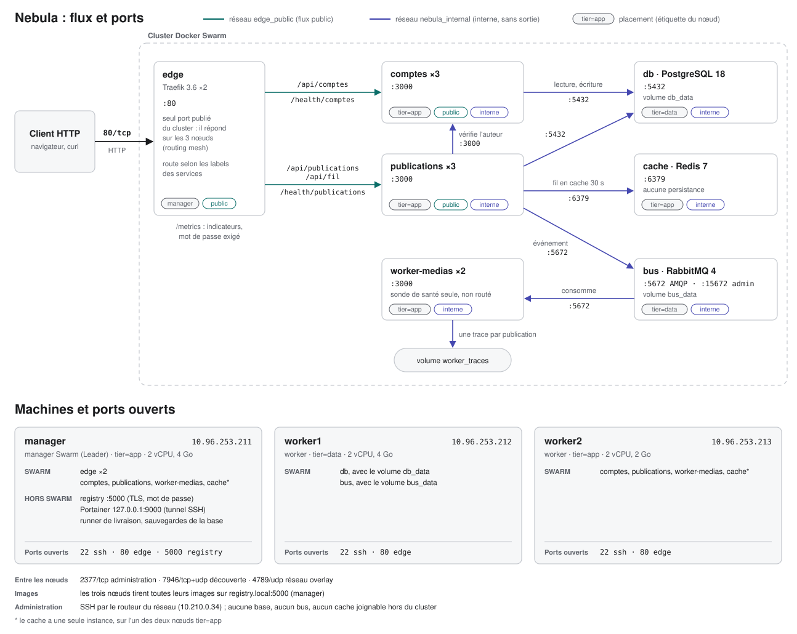

# Nebula : infrastructure Docker Swarm

Déploiement et exploitation de Nebula sur un cluster Docker Swarm de trois
machines virtuelles (Docker Engine 29.8). Le code des trois services
applicatifs est celui fourni, inchangé. Seuls leurs Dockerfile ont été
adaptés : image de base paramétrable, dossier des traces du worker.

| Document | Contenu |
|---|---|
| [docs/cluster.md](docs/cluster.md) | Recréer les trois machines et le cluster depuis zéro, topologie justifiée, pare-feu et matrice de flux |
| [docs/procedures.md](docs/procedures.md) | Les cinq procédures d'exploitation |
| [docs/scenarios.md](docs/scenarios.md) | Les dix scénarios de vérification : commandes et preuves |
| [docs/preuves/](docs/preuves/) | Sorties de commandes relevées sur le cluster |

## Architecture



`comptes` et `publications` sont sur les deux réseaux : `edge_public` pour
recevoir le trafic de l'edge, `nebula_internal` pour joindre la base, le
cache et le bus.

| Machine | Rôle | Étiquette | Ce qui y tourne |
|---|---|---|---|
| `manager` 10.96.253.211 | manager | `tier=app` | edge, services sans état, cache. Hors Swarm : registry, Portainer, runner de livraison |
| `worker1` 10.96.253.212 | worker | `tier=data` | db, bus |
| `worker2` 10.96.253.213 | worker | `tier=app` | services sans état, cache |

## Les sept services

| Service | Image | Instances | Placement | Réseaux | État |
|---|---|---|---|---|---|
| `edge` (`edge_traefik`) | traefik v3.6.25 | 2 | manager | edge_public | aucun |
| `comptes` | nebula-comptes | 3 | `tier=app` | edge_public, internal | aucun |
| `publications` | nebula-publications | 3 | `tier=app` | edge_public, internal | aucun |
| `worker-medias` | nebula-worker-medias | 2 | `tier=app` | internal | volume `worker_traces` (une trace par publication) |
| `db` | postgres 18-alpine | 1 | `tier=data` | internal | volume `db_data` |
| `cache` | redis 7-alpine | 1 | `tier=app` | internal | aucun (pas de persistance) |
| `bus` | rabbitmq 4-management-alpine | 1 | `tier=data` | internal | volume `bus_data` |

Fichiers : [swarm/stack.edge.yml](swarm/stack.edge.yml) et
[swarm/stack.nebula.yml](swarm/stack.nebula.yml). Chaque service a une sonde
de santé, des limites de ressources et une politique de redémarrage.

### Technologies au choix

- **Edge : Traefik.** Le routage est déclaré par chaque service dans ses
  labels. Ajouter un service ne modifie pas l'edge, ce qu'un nginx à
  configuration statique ne permet pas. Version 3.6.25 : les versions
  antérieures à 3.6.1, dont la 3.3 du squelette, sont refusées par l'API de
  Docker 29 (`client version 1.24 is too old`).
- **Bus : RabbitMQ.** Les services fournis parlent AMQP (`amqplib`). File
  durable, messages persistants, acquittement après traitement : un message
  dont le worker meurt en cours de traitement est redistribué.
- **Services applicatifs : Node 24**, ceux du squelette.

### Routes

| Route publique | Service | Route du service |
|---|---|---|
| `POST /api/comptes`, `GET /api/comptes/{id}` | comptes | `/comptes`, `/comptes/{id}` |
| `POST /api/publications` | publications | `/publications` |
| `GET /api/fil` | publications | `/fil` |
| `GET /health/comptes`, `GET /health/publications` | comptes, publications | `/health` |
| `GET /api/health` | comptes | `/health` |
| `GET /metrics` | edge | indicateurs, mot de passe exigé |

`worker-medias` n'est pas routé : sa route `/health` ne sert qu'à la sonde
de santé du conteneur.

## Réseaux et exposition

- **Un seul port publié par le cluster : 80** (edge, mode ingress). Il
  répond sur manager et worker2 ; le pare-feu le ferme sur worker1, qui ne
  porte que les données.
- `nebula_internal` est déclaré `internal: true` : pas de sortie vers
  l'extérieur, aucun port publiable. `db`, `bus`, `cache` et `worker-medias`
  ne sont que sur ce réseau.
- **Pare-feu sur chaque machine** : tout est refusé par défaut, et chaque
  ouverture a un sens. Les workers joignent le manager (2377, 5000), pas
  l'inverse. Les nœuds applicatifs ouvrent des connexions vers la base et le
  bus ; le nœud de données n'en ouvre aucune vers eux. Matrice de flux
  complète dans [docs/cluster.md](docs/cluster.md).
- **Portainer** (outil d'administration) n'est pas un service du cluster. Il
  écoute sur `127.0.0.1:9000` du manager : accès par tunnel SSH
  (`ssh -L 9000:127.0.0.1:9000 manager`), puis mot de passe.
- **Registry** : port 5000 du manager, hors cluster, TLS et authentification,
  joignable par les trois nœuds seulement.
- **SSH** : depuis le routeur du réseau uniquement.

## Secrets et configurations

Aucun identifiant dans le dépôt. Les secrets sont créés sur le manager par
`make secrets` ([scripts/secrets.sh](scripts/secrets.sh)), tirés au hasard.

| Secret Swarm | Utilisé par | Contenu |
|---|---|---|
| `nebula_db_password` | db, comptes, publications | mot de passe PostgreSQL |
| `nebula_cache_password` | cache, publications | mot de passe Redis |
| `nebula_bus_password` | publications, worker-medias | mot de passe RabbitMQ |
| `nebula_bus_definitions` | bus | utilisateur (empreinte du mot de passe), file et politique des messages en erreur |
| `edge_admin_users` | edge | fichier htpasswd de la route `/metrics` |

Les applications ne lisent `AMQP_URL` et `REDIS_URL` que dans leur
environnement. [config/entrypoint.sh](config/entrypoint.sh), monté comme
config Swarm, construit ces URL à partir des secrets au démarrage du
conteneur : les mots de passe n'apparaissent ni dans le fichier de stack ni
dans `docker service inspect`.

| Config Swarm | Fichier |
|---|---|
| `nebula_entrypoint_v1` | `config/entrypoint.sh` |
| `nebula_db_init_v1` | `db/init.sql` (schéma, exécuté sur un volume vide) |
| `nebula_bus_conf_v1` | `config/rabbitmq.conf` |

Une config Swarm est immuable : pour en changer le contenu, changer le
suffixe de version dans `swarm/stack.nebula.yml`.

## Mises à jour et retour arrière

Paramètres des trois services sans état (`x-app-deploy` dans le fichier de
stack) :

| Paramètre | Valeur | Effet |
|---|---|---|
| `order` | `start-first` | la nouvelle tâche doit être saine avant l'arrêt de l'ancienne |
| `parallelism` | 1 | une tâche à la fois |
| `monitor` | 15s | durée d'observation après chaque tâche |
| `failure_action` | `rollback` | une tâche qui échoue ramène le service à la version précédente |
| sonde de santé | 5 s, 3 essais, 20 s de démarrage | une version qui ne répond pas est déclarée en échec en moins d'une minute |
| `DRAIN_SECONDS` | 10 | une tâche arrêtée répond encore 10 s, le temps que l'edge la retire |

Côté edge : sonde active de chaque tâche toutes les 3 s et rejeu d'une
requête sur une autre tâche si la première ne répond pas.

Mesures relevées ([docs/scenarios.md](docs/scenarios.md)) : mise à jour des
trois services en 66 s, 1192 requêtes sur 1192 abouties pendant la mise à
jour ; version défectueuse détectée et retirée en 55 s, sans requête en
échec. `db` et `bus` sont mis à jour en `stop-first` : un seul processus à
la fois sur leur volume.

## Versions et traçabilité

- Chaque image applicative porte deux tags qui désignent la même image :
  la version (`v1.0.0`) et l'empreinte du commit (`sha-92e9cb6`). Le commit
  complet est dans le label `org.opencontainers.image.revision`.
- `latest` est refusé par les scripts. Un tag déjà publié n'est jamais
  réécrit : `build-push.sh` s'arrête si la version ou le commit existe déjà
  dans le registry.
- Au déploiement, Swarm enregistre l'empreinte `sha256` de l'image dans le
  service : tous les nœuds exécutent la même image.
- `GET /health/<service>` renvoie le service, sa version et le nom du
  conteneur.
- Une commande, `make status`, donne les nœuds, les services, et pour chaque
  instance sa version et sa machine. Elle exécute notamment :

  ```bash
  docker stack ps nebula --filter desired-state=running \
    --format 'table {{.Name}}\t{{.Image}}\t{{.Node}}\t{{.CurrentState}}'
  ```

## Livraison

```
git tag v1.1.0 ──> CI : construit ─> analyse ─> tague ─> publie      (automatique)
                   CD : déploie v1.1.0                                (déclenché à la main)
```

- **Registry** privé `registry.local:5000`, sur le manager, hors Swarm. Il
  contient les images applicatives et, sous `mirror/`, les images tierces.
- **CI** ([.github/workflows/ci.yml](.github/workflows/ci.yml)). À chaque
  commit : validation des scripts, des fichiers de stack, et construction.
  Sur un tag `vX.Y.Z` : `scripts/build-push.sh` construit les trois images,
  les analyse (grype, bloquant sur une vulnérabilité critique corrigeable),
  les tague et les publie.
- **CD** ([.github/workflows/cd.yml](.github/workflows/cd.yml)). Déclenché à
  la main avec le tag à déployer, dans l'environnement `production`. Il
  lance `scripts/deploy.sh` et ne construit rien : c'est l'image publiée par
  la CI qui est déployée.
- **Runner** installé sur le manager, hors Swarm : le registry et le cluster
  sont sur un réseau privé.
- **Identifiants** : `REGISTRY_USER` et `REGISTRY_PASSWORD` sont des secrets
  du dépôt GitHub. Le déploiement passe par le socket Docker du manager,
  sans clé SSH.

Preuves d'exécution :

- [docs/preuves/livraison-github-actions.txt](docs/preuves/livraison-github-actions.txt) :
  la CI sur le tag `v1.2.0`, puis le CD déclenché à la main avec ce tag,
  avec les liens des exécutions et des extraits de leurs journaux ;
- [docs/preuves/livraison-construction.txt](docs/preuves/livraison-construction.txt) :
  le même script lancé sur le manager, le refus d'un tag déjà publié et le
  refus de publication quand l'analyse dépasse le seuil.

## Exploitation

Sur le manager, dans `~/nebula`. `make help` liste les commandes.

| Besoin | Commande |
|---|---|
| État : nœuds, services, instances, versions, machines | `make status` |
| Journaux d'un service | `make logs S=comptes` |
| Journaux d'une instance | `make logs S=comptes I=2` (numéro donné par `make status`) |
| Vérifier la chaîne applicative | `make smoke` |
| Changer le nombre d'instances | `make scale S=comptes N=5` |
| Déployer ou mettre à jour | `make deploy TAG=v1.1.0` |
| Sauvegarder, restaurer la base | `make backup`, `make restore` |
| Messages en attente et en erreur sur le bus | `make bus` |
| Ports qui répondent sur chaque nœud | `make exposition` |
| Ajouter un service | `make service NOM=... IMAGE=... PORT=...` |
| Indicateurs (requêtes et codes par service) | `curl -u admin http://<nœud>/metrics` (mot de passe demandé) |

**Messages en erreur.** Un message que le worker rejette est renvoyé par
RabbitMQ dans la file `publications.erreurs` au lieu d'être détruit. `make
bus` affiche le nombre de messages de chaque file.

**Ajouter un service.** `make service` crée
`swarm/services/<nom>.yml` à partir de
[swarm/services/_gabarit.yml](swarm/services/_gabarit.yml) et redéploie.
Les fichiers de ce dossier sont fusionnés avec la stack : les réseaux et les
secrets sont déjà déclarés, les sept autres services ne sont pas redémarrés,
l'edge n'est pas modifié.

## Hypothèses et limites

- **Le manager est un point de défaillance unique** : plan de contrôle, edge,
  registry et runner. Choix justifié dans [docs/cluster.md](docs/cluster.md).
- **Une seule instance de base**, sur worker1. La perte de worker1 arrête
  Nebula jusqu'à son retour ou jusqu'à une restauration. Les sauvegardes sont
  lancées à la main (`make backup`) et rangées sur le manager uniquement.
- **Traces du worker** : volume local, un par nœud. Les traces sont réparties
  sur les nœuds `tier=app`.
- **Pas de chiffrement du point d'entrée** : HTTP sur le port 80.
- **Pare-feu** : la sortie des machines n'est pas filtrée. Dans le réseau
  overlay, le sens des connexions n'est contrôlé que pour TCP.
- **`/metrics` est servi sur le port public**, derrière un mot de passe.
- **Docker Hub** limite les tirages à 100 par heure et par adresse IP,
  partagée ici. Les images tierces sont copiées une fois dans le registry
  privé depuis un miroir public (`infra/images.txt`). Seule l'image de
  Portainer vient de Docker Hub.
- **Le runner** a accès au socket Docker du manager : le dépôt GitHub doit
  rester privé.
- **L'edge monte le socket Docker du manager**, nécessaire pour lire les
  labels des services. Le montage en lecture seule protège le fichier, pas
  l'API Docker.
- **Mot de passe de la base** : PostgreSQL le fixe à l'initialisation du
  volume. Recréer le secret `nebula_db_password` sans recréer le volume
  empêche les applications de se connecter.
- **Après un redémarrage complet**, les instances d'un service sans état
  peuvent se retrouver sur un seul nœud : `make rebalance` les répartit.
- **`docker service rollback`** échange la version courante et la
  précédente : le lancer deux fois ramène la version retirée.

## Arborescence

```
cluster/     construction du cluster : machines, Docker, Swarm, dépôt, registry, runner
infra/       registry et Portainer (Docker Compose, hors Swarm), images tierces
swarm/       stack.edge.yml, stack.nebula.yml, services/ (services ajoutés)
config/      script d'entrée des services, configuration du bus
scripts/     exploitation : secrets, build, deploy, status, smoke, backup, restore...
services/    code fourni des trois services et leurs Dockerfile
db/          init.sql
docs/        cluster, procédures, scénarios, preuves
.github/     workflows CI et CD
Makefile     point d'entrée des commandes
```

Poste de développement, hors Swarm : `cp .env.example .env && make dev`.
